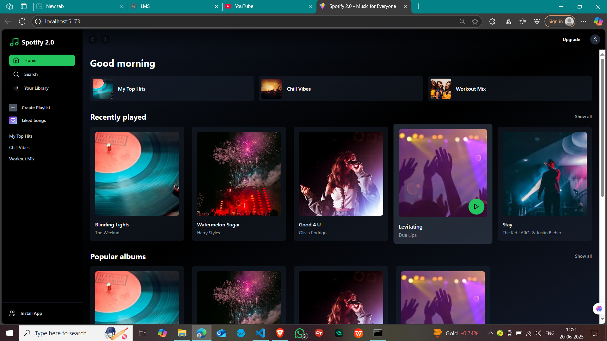
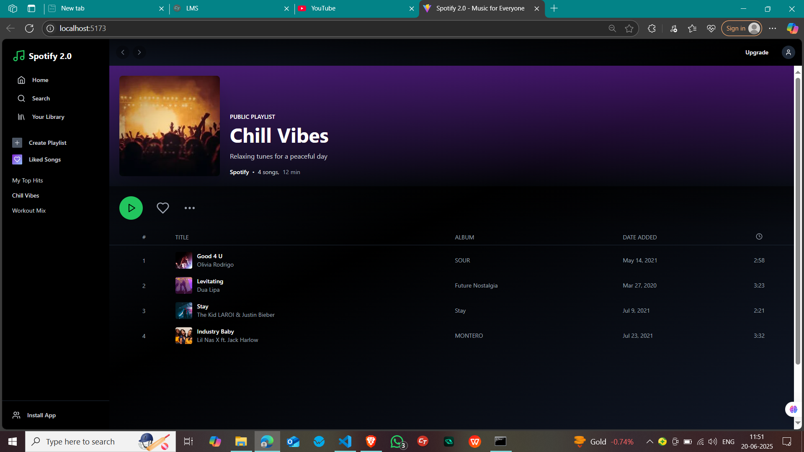
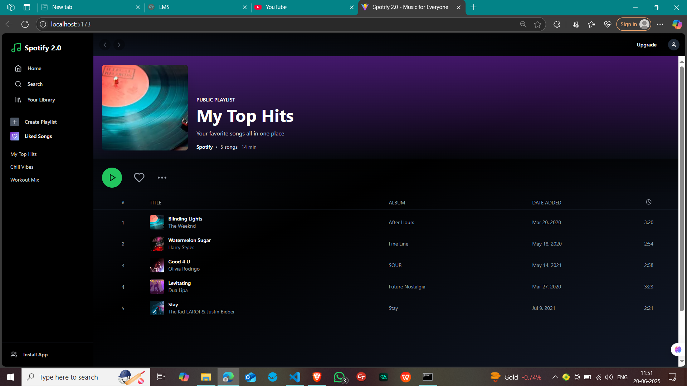

# 🎧 Spotify Clone

A modern and responsive **Spotify Clone** built using **React**, **TypeScript**, **Tailwind CSS**, and **Vite**. 
This project replicates the core UI and functionality of Spotify including navigation, playlists, albums, search, and a player.

---

## 🔥 Features

- 🎵 Play, pause, and skip tracks
- 📻 View albums and playlists
- 🔍 Search functionality
- 🎚 Custom audio player using hooks
- 📁 Modular component architecture
- ⚡ Fast and optimized with Vite

---

## 🖼️ Screenshots

> Add your screenshots in the `assets` or `public` folder and reference them below:

### 🏠 Home Page


### 🎼 Album View


### 🔍 Search


### ▶️ Player


---

## 🛠️ Tech Stack

- **Frontend**: React + TypeScript
- **Styling**: Tailwind CSS
- **Build Tool**: Vite
- **State Management**: React Hooks & Custom Hooks

---

## 📦 Installation

### Clone the repository
```bash
git clone https://github.com/your-username/spotify-clone.git
cd spotify-clone
